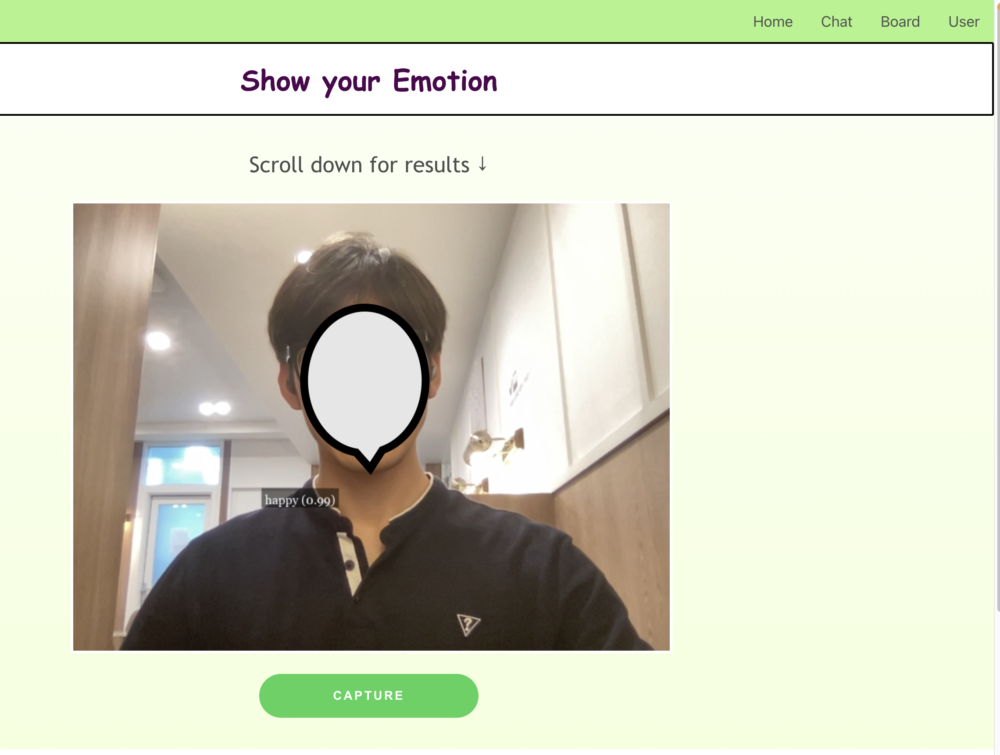
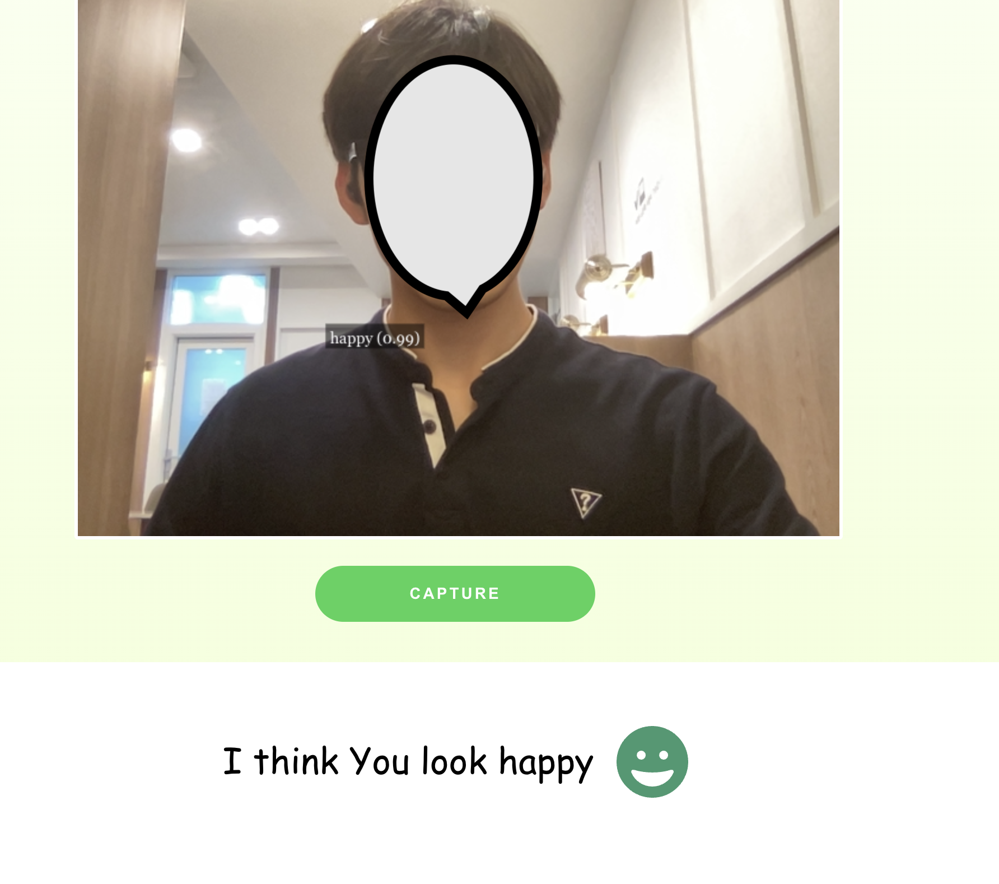
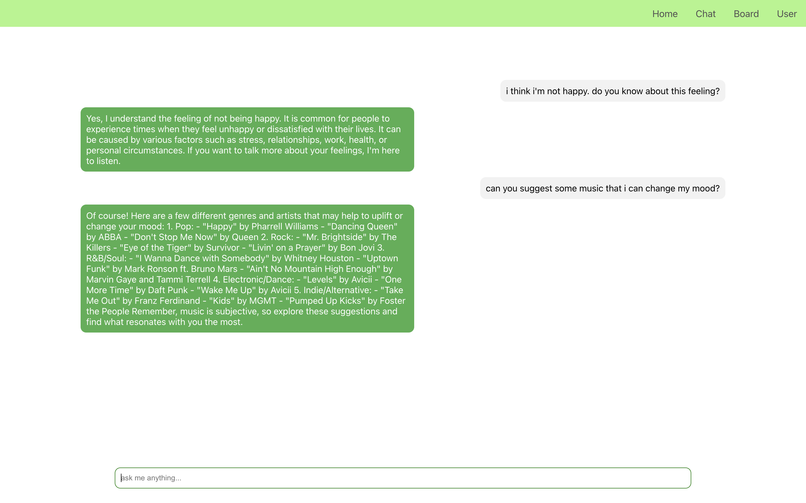

# This is Demo

### To start, add .env

1. add .env in front folder.
   write REACT_APP_SERVER_URL. ex -> REACT_APP_SERVER_URL=http://127.0.0.1:8000
   add .env in EDbackend folder.
   write OPENAI_API_KEY. (see more about in EDbackend/api/viws.py. now i do hard coding response. change it.)

### handle your cors origin issue

2. by filling CORS_ORIGIN_WHITELIST, ALLOWED_HOSTS in EDbackend/EDbackend/settings.py

### RUN

3. try this command for run.

'''
docker-compose up -d
'''

### error handling

check out nginx/nginx-setup.conf
check out EDbackend/EDbackend/settings.py

### if you wanna know more about this project, check out project-introduce.pdf

